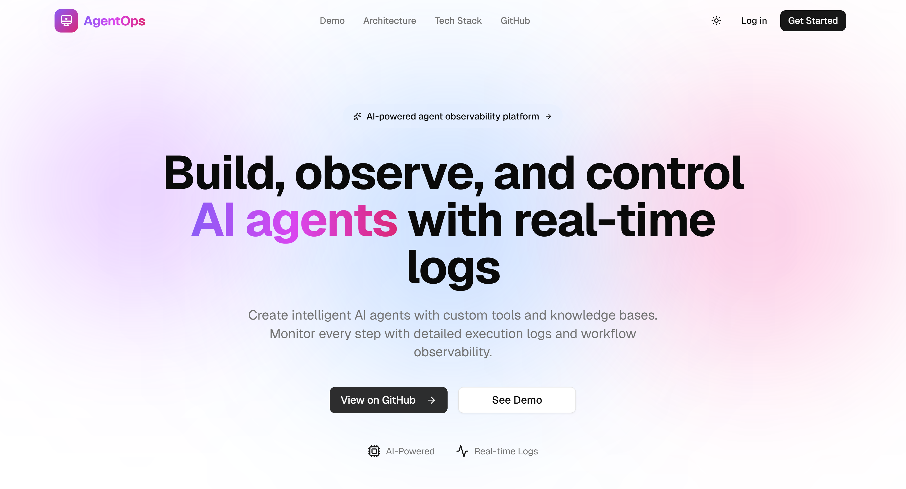
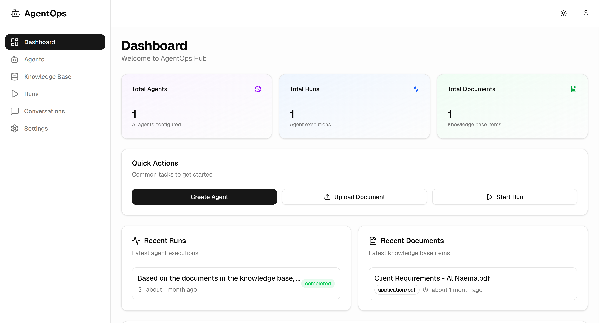
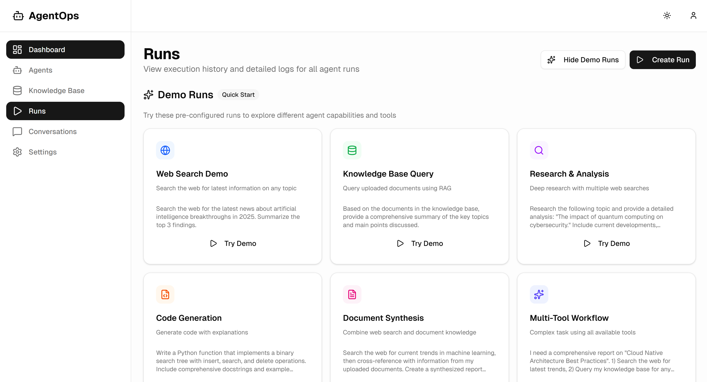
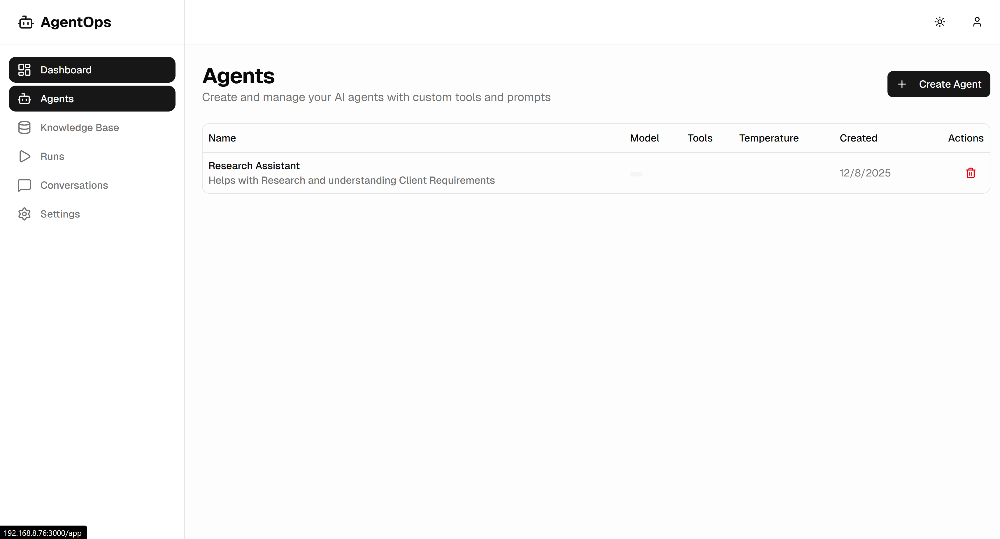

# AgentOps Hub 🤖

<div align="center">

**A production-ready AI agent orchestration platform with RAG capabilities, real-time streaming, and multi-tool execution**

Full-stack TypeScript/Python • 25+ REST endpoints • Real-time SSE streaming • Vector database integration

[](https://github.com/akhundmuzzammil/agentops-hub/stargazers)
[](https://github.com/akhundmuzzammil/agentops-hub/network/members)
[](https://github.com/akhundmuzzammil/agentops-hub/issues)
[](https://github.com/akhundmuzzammil/agentops-hub/blob/main/LICENSE)
[](https://github.com/akhundmuzzammil/agentops-hub/pulls)


[Live Demo](#) • [Documentation](#-api-documentation) • [Report Bug](../../issues) • [Request Feature](../../issues)

</div>

---

## 📋 Table of Contents

- [About](#-about)
- [Screenshots](#-screenshots)
- [Features](#-features)
- [Tech Stack](#-tech-stack)
- [Getting Started](#-getting-started)
- [Project Structure](#-project-structure)
- [API Documentation](#-api-documentation)
- [Contributing](#-contributing)
- [License](#-license)
- [Contact](#-contact)

---

## 🎯 About

AgentOps Hub is an AI agent management platform that allows users to create intelligent agents with customizable tools, execute tasks in real-time, and monitor execution with detailed logging. The platform features a modern React frontend, FastAPI backend, PostgreSQL database, and Qdrant vector database for semantic search capabilities.

### Why This Project?

This project demonstrates modern software engineering practices including microservices architecture, real-time data streaming, vector databases, LLM integration, and production-ready authentication.

---

## 📸 Screenshots

<div align="center">

<table>
  <tr>
    <td width="50%">
      
      <p align="center"><b>Dashboard Overview</b></p>
    </td>
    <td width="50%">
      
      <p align="center"><b>Agent Management</b></p>
    </td>
  </tr>
  <tr>
    <td width="50%">
      
      <p align="center"><b>Real-time Execution</b></p>
    </td>
    <td width="50%">
      
      <p align="center"><b>Knowledge Base</b></p>
    </td>
  </tr>
</table>

</div>

---

## ✨ Features

### 🤖 Agent Management
- Create and configure AI agents with custom instructions
- Multiple AI models (GPT-4, GPT-3.5-turbo)
- Tool selection: Web Search, Knowledge Base (RAG)
- Full CRUD operations with user isolation

### ⚡ Real-Time Execution
- Server-Sent Events (SSE) for live streaming
- Step-by-step execution visualization
- Tool call tracking and results
- State management (queued → running → completed/failed)

### 📚 Knowledge Base (RAG)
- Multi-format document support (PDF, DOCX, Excel, CSV, Images with OCR)
- Automatic text chunking and embedding (OpenAI Ada-002)
- Vector similarity search with Qdrant
- YouTube transcript extraction

### 🌐 Web Search Integration
- DuckDuckGo search tool
- Real-time web scraping
- Automatic result summarization

### 💬 Conversation Management
- Multi-turn conversations with context memory
- Message history and threading
- Persistent conversation state

### 🔐 Security
- JWT-based authentication
- Password hashing with bcrypt
- User data isolation
- Protected routes and API endpoints

---

## 🛠️ Tech Stack

### Frontend
- **Next.js 16** - React framework with App Router
- **React 19** - UI library
- **TypeScript** - Type safety
- **Tailwind CSS** - Styling
- **shadcn/ui** - Component library
- **Axios** - HTTP client
- **React Hook Form + Zod** - Form management and validation

### Backend
- **FastAPI** - Python web framework
- **SQLAlchemy** - ORM
- **PostgreSQL** - Primary database
- **Qdrant** - Vector database for semantic search
- **OpenAI API** - LLM (GPT-4) and embeddings (Ada-002)
- **JWT** - Authentication
- **Uvicorn** - ASGI server

### DevOps & Tools
- **Docker Compose** - Container orchestration
- **Git** - Version control
- **pytesseract** - OCR for image processing
- **DuckDuckGo** - Web search integration

---

## 🚀 Getting Started

### Prerequisites

- **Python 3.11+**
- **Node.js 18+**
- **Docker & Docker Compose**
- **OpenAI API Key** - [Get one here](https://platform.openai.com/api-keys)

### Installation

1. **Clone the repository**
   ```bash
   git clone https://github.com/akhundmuzzammil/agentops-hub.git
   cd agentops-hub
   ```

2. **Start databases with Docker**
   ```bash
   docker-compose up -d
   ```

3. **Backend setup**
   ```bash
   cd backend
   python -m venv .venv
   source .venv/bin/activate  # Windows: .venv\Scripts\activate
   pip install -r requirements.txt
   
   # Configure environment
   cp .env.example .env
   # Edit .env and add your OPENAI_API_KEY
   
   # Run migrations and seed data
   python migrate_new_features.py
   python seed.py
   
   # Start server
   python -m uvicorn app.main:app --reload
   ```

4. **Frontend setup** (new terminal)
   ```bash
   cd frontend
   npm install
   cp .env.local.example .env.local
   npm run dev
   ```

5. **Access the application**
   - Frontend: http://localhost:3000
   - Backend API: http://127.0.0.1:8000
   - API Docs: http://127.0.0.1:8000/docs

---

## 📁 Project Structure

```
agentops-hub/
├── backend/              # FastAPI backend
│   ├── app/
│   │   ├── api/v1/      # REST endpoints
│   │   ├── ai/          # Agent execution engine
│   │   ├── models/      # Database models
│   │   ├── schemas/     # Pydantic schemas
│   │   └── services/    # Business logic
│   ├── requirements.txt
│   └── .env.example
├── frontend/             # Next.js frontend
│   ├── src/
│   │   ├── app/         # Pages and routes
│   │   ├── components/  # React components
│   │   └── lib/         # Utilities and API client
│   ├── package.json
│   └── .env.local.example
├── docker-compose.yml    # PostgreSQL + Qdrant
├── LICENSE
└── README.md
```

For detailed documentation, see:
- [Backend README](backend/README.md)
- [Frontend README](frontend/README.md)is available when the backend is running:

- **Swagger UI**: http://127.0.0.1:8000/docs
- **ReDoc**: http://127.0.0.1:8000/redoc

### Key Endpoints

| Method | Endpoint | Description |
|--------|----------|-------------|
| POST | `/api/v1/auth/signup` | User registration |
| POST | `/api/v1/auth/login` | User login |
| GET | `/api/v1/agents` | List agents |
| POST | `/api/v1/agents` | Create agent |
| POST | `/api/v1/runs` | Create run |
| GET | `/api/v1/streaming/runs/{id}` | SSE streaming |
| POST | `/api/v1/documents/upload` | Upload document |
| GET | `/api/v1/conversations` | List conversations |

---

## 🧪 Testing

Run the comprehensive test suite:

```bash
cd backend
python testing.py
```

Tests cover authentication, agent CRUD, run execution, document processing, web search, and RAG retrieval.

---

## 🤝 Contributing

Contributions, issues, and feature requests are welcome! See [CONTRIBUTING.md](CONTRIBUTING.md) for guidelines.

1. Fork the project
2. Create your feature branch (`git checkout -b feature/AmazingFeature`)
3. Commit your changes (`git commit -m 'Add some AmazingFeature'`)
4. Push to the branch (`git push origin feature/AmazingFeature`)
5. Open a Pull Request

---

## 📄 License

This project is licensed under the MIT License - see the [LICENSE](LICENSE) file for details.

---

## 👤 Contact

**Muzzammil Akhund**

- Website: [akhundmuzzammil.com](https://akhundmuzzammil.com)
- LinkedIn: [@akhundmuzzammil](https://linkedin.com/in/akhundmuzzammil)
- GitHub: [@akhundmuzzammil](https://github.com/akhundmuzzammil)
- Twitter: [@akhundmuzzammil](https://twitter.com/akhundmuzzammil)

---

## 🙏 Acknowledgments

- [OpenAI](https://openai.com) - GPT-4 and embedding models
- [FastAPI](https://fastapi.tiangolo.com) - Modern Python web framework
- [Next.js](https://nextjs.org) - React framework
- [shadcn/ui](https://ui.shadcn.com) - Beautiful component library
- [Qdrant](https://qdrant.tech) - Vector database

---

<div align="center">

**⭐ Star this repo if you find it helpful!**

Built with ❤️ by [Muzzammil Akhund](https://akhundmuzzammil.com)

</div>